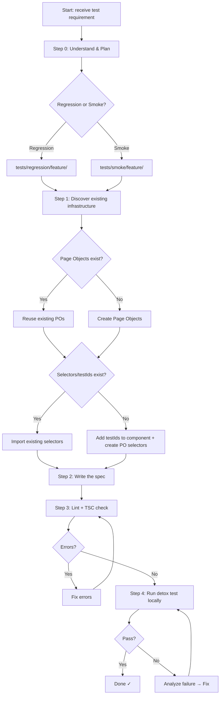

# E2E Test Builder

**Goal**: Add new E2E tests (regression or smoke) to the MetaMask Mobile codebase using the Detox framework, following all established rules and patterns. Runs the test locally and iterates until it passes.

## Decision Flowchart



## Step 0: Understand & Plan

Before writing a single line of code:

1. **Read the requirement** — What user flow or behavior needs to be tested?
2. **Determine test type**:
   - **Smoke** (`tests/smoke/`) — Critical happy paths; must be fast and stable
   - **Regression** (`tests/regression/`) — Broader scenarios, edge cases, feature coverage
3. **Identify the feature folder** — e.g., `perps`, `swap`, `wallet`, `ramps`, `networks`
4. **Choose the tag** — Import from `tests/tags.ts`:
   - `SmokeE2E(...)` for smoke
   - `RegressionTrade(...)`, `RegressionWallet(...)`, etc. for regression
5. **Scan for existing infrastructure**:

```bash
# Find existing page objects for your feature
ls tests/page-objects/<Feature>/

# Find existing selectors
ls tests/selectors/<Feature>/
grep -r "testID" app/components/UI/<Feature>/ --include="*.tsx" -l

# Find existing helpers
ls tests/helpers/<feature>/

# Find existing API mocks
ls tests/api-mocking/mock-responses/
```

## Step 1: Prepare Infrastructure

### 1a. Page Objects

Page Objects live in `tests/page-objects/<Feature>/`. Each PO maps one screen/component.

**Structure**:

```typescript
// tests/page-objects/Predict/PredictMarketList.ts
import Matchers from '../../framework/Matchers';
import Gestures from '../../framework/Gestures';
import Assertions from '../../framework/Assertions';
import { PredictMarketListSelectorsIDs } from '../../../app/components/UI/Predict/PredictMarketList.testIds';

class PredictMarketList {
  get container() {
    return Matchers.getElementByID(PredictMarketListSelectorsIDs.CONTAINER);
  }

  get firstMarketCard() {
    return Matchers.getElementByID(PredictMarketListSelectorsIDs.MARKET_CARD);
  }

  async tapFirstMarketCard(): Promise<void> {
    await Gestures.tap(this.firstMarketCard, {
      description: 'tap first market card',
    });
  }

  async expectContainerVisible(): Promise<void> {
    await Assertions.expectElementToBeVisible(this.container, {
      description: 'market list container should be visible',
    });
  }
}

export default new PredictMarketList();
```

**Rules**:

- Always use `Matchers.getElementByID()` — never `element(by.id())`
- Actions: `Gestures.tap()`, `Gestures.typeText()`, `Gestures.swipe()`
- Assertions: `Assertions.expectElementToBeVisible()`, `Assertions.expectElementToNotBeVisible()`
- Every `tap` / `typeText` / assertion must include a `description` string
- Export a singleton: `export default new MyView()`

### 1b. Selectors / TestIds

Selectors are defined as constants. Two locations:

**Preferred — co-located with the component**:

```typescript
// app/components/UI/Predict/PredictMarketList.testIds.ts
export const PredictMarketListSelectorsIDs = {
  CONTAINER: 'predict-market-list-container',
  MARKET_CARD: 'predict-market-list-card',
  SEARCH_INPUT: 'predict-market-list-search',
} as const;
```

**Legacy — under tests/selectors/**:

```typescript
// tests/selectors/Predict/PredictMarketList.selectors.ts
export const PredictMarketListSelectorsIDs = {
  CONTAINER: 'predict-market-list-container',
} as const;
```

Prefer co-location with the component (`*.testIds.ts`) for new code.

### 1c. Feature Helpers (optional)

For repeated multi-step flows, add a helper:

```typescript
// tests/helpers/predict/predict-helpers.ts
import PredictMarketList from '../../page-objects/Predict/PredictMarketList';

export class PredictHelpers {
  static async navigateToMarket(symbol: string): Promise<void> {
    await PredictMarketList.tapMarketBySymbol(symbol);
  }
}
```

### 1d. API Mocks

If the feature calls external APIs, create a mock response file:

```typescript
// tests/api-mocking/mock-responses/predict-mocks.ts
import { MockApiEndpoint } from '../framework/types';

export const PREDICT_MOCKS = {
  GET: [
    {
      urlEndpoint: 'https://predict.api.metamask.io/markets',
      responseCode: 200,
      response: { markets: [{ id: 'btc-usd', name: 'BTC/USD' }] },
    },
  ] as MockApiEndpoint[],
};
```

Use in the test via `testSpecificMock`:

```typescript
const testSpecificMock = async (mockServer: Mockttp) => {
  // Use setupRemoteFeatureFlagsMock for feature flags
  await setupRemoteFeatureFlagsMock(mockServer, {
    predictTradingEnabled: true,
  });
};
```

## Step 2: Write the Spec

### Minimal Smoke Test Template

```typescript
// tests/smoke/predict/predict-market-browse.spec.ts
import { loginToApp } from '../../flows/wallet.flow';
import { withFixtures } from '../../framework/fixtures/FixtureHelper';
import { SmokeE2E } from '../../tags';
import FixtureBuilder from '../../framework/fixtures/FixtureBuilder';
import TabBarComponent from '../../page-objects/wallet/TabBarComponent';
import PredictMarketList from '../../page-objects/Predict/PredictMarketList';
import { PREDICT_MOCKS } from '../../api-mocking/mock-responses/predict-mocks';

describe(SmokeE2E('Predict Market Browse'), () => {
  it('displays market list after navigating to Predict tab', async () => {
    await withFixtures(
      {
        fixture: new FixtureBuilder().build(),
        restartDevice: true,
        testSpecificMock: PREDICT_MOCKS,
      },
      async () => {
        await loginToApp();
        await TabBarComponent.tapPredictTab();
        await PredictMarketList.expectContainerVisible();
      },
    );
  });
});
```

### Regression Test Template (with API mocking and feature flags)

```typescript
// tests/regression/predict/predict-buy-flow.spec.ts
import { Mockttp } from 'mockttp';
import { loginToApp } from '../../flows/wallet.flow';
import { withFixtures } from '../../framework/fixtures/FixtureHelper';
import { RegressionTrade } from '../../tags';
import FixtureBuilder from '../../framework/fixtures/FixtureBuilder';
import { setupRemoteFeatureFlagsMock } from '../../api-mocking/helpers/remoteFeatureFlagsHelper';
import { setupMockRequest } from '../../api-mocking/mockHelpers';
import PredictMarketList from '../../page-objects/Predict/PredictMarketList';
import PredictDetailsPage from '../../page-objects/Predict/PredictDetailsPage';
import { createLogger, LogLevel } from '../../framework/logger';

const logger = createLogger({ name: 'PredictBuySpec', level: LogLevel.INFO });

const testSpecificMock = async (mockServer: Mockttp) => {
  await setupRemoteFeatureFlagsMock(mockServer, {
    predictTradingEnabled: true,
  });
  await setupMockRequest(mockServer, {
    requestMethod: 'GET',
    url: 'https://predict.api.metamask.io/markets',
    response: { markets: [{ id: 'btc-yes', name: 'BTC above $100k?' }] },
    responseCode: 200,
  });
};

describe(RegressionTrade('Predict Buy Flow'), () => {
  it('opens market details from market list', async () => {
    await withFixtures(
      {
        fixture: new FixtureBuilder().build(),
        restartDevice: true,
        testSpecificMock,
      },
      async () => {
        logger.info('Navigating to Predict feature');
        await loginToApp();
        await PredictMarketList.tapFirstMarketCard();
        await PredictDetailsPage.expectScreenVisible();
        logger.info('Market details screen verified');
      },
    );
  });
});
```

### Spec Rules (MANDATORY)

| Rule         | DO                                                         | DON'T                                  |
| ------------ | ---------------------------------------------------------- | -------------------------------------- |
| Test setup   | `withFixtures` + `FixtureBuilder`                          | Manual state through UI                |
| Imports      | `tests/framework/index.ts`                                 | Individual utility files               |
| UI actions   | Page Object methods                                        | `element(by.id()).tap()`               |
| Assertions   | `Assertions.expectElementToBeVisible(el, { description })` | `waitFor(element).toBeVisible()`       |
| Waiting      | `Assertions.*` (auto-retry built-in)                       | `TestHelpers.delay()` / `setTimeout()` |
| Descriptions | Required on every gesture and assertion                    | Omitting `description` param           |
| Test names   | `'opens market details'`                                   | `'should open market details'`         |
| State setup  | `FixtureBuilder` methods (`.withGanacheNetwork()`, etc.)   | Navigating through UI to set state     |

## Step 3: Lint & Type Check

Run both before executing the test:

```bash
# From the metamask-mobile root
yarn lint tests/regression/<feature>/<spec>.spec.ts --fix
yarn lint tests/page-objects/<Feature>/<PO>.ts --fix
yarn lint:tsc
```

Fix all errors. Do not run the test with lint/tsc errors.

## Step 4: Run the Test Locally

Requires a built app (debug build). Run a single spec:

```bash
# iOS (most common for local runs)
IS_TEST='true' NODE_OPTIONS='--experimental-vm-modules' \
  detox test -c ios.sim.main \
  --testPathPattern="tests/<regression|smoke>/<feature>/<spec>.spec.ts"

# Android
IS_TEST='true' NODE_OPTIONS='--experimental-vm-modules' \
  detox test -c android.emu.main \
  --testPathPattern="tests/<regression|smoke>/<feature>/<spec>.spec.ts"

# Run a specific test by name
IS_TEST='true' NODE_OPTIONS='--experimental-vm-modules' \
  detox test -c ios.sim.main \
  --testPathPattern="<spec>.spec.ts" \
  --testNamePattern="<exact test name>"
```

> If the app is not built yet: `yarn test:e2e:ios:debug:build` first.

## Step 5: Iterate Until Green

When the test fails:

1. **Read the full error** — Detox errors include element info, action, and timeout details
2. **Common failure causes**:

| Symptom                | Cause                              | Fix                                                     |
| ---------------------- | ---------------------------------- | ------------------------------------------------------- |
| Element not found      | Wrong testID, element not rendered | Check selector, verify component renders                |
| Element not enabled    | Disabled/loading state             | Add `checkEnabled: false` or wait for state             |
| Timed out waiting      | Element appears but too slow       | Adjust `Assertions` timeout options                     |
| Animation interference | Carousel/modal animations          | Add `checkStability: true` to gestures                  |
| Unmocked API request   | Network call not intercepted       | Add mock in `testSpecificMock`                          |
| Feature flag gated     | Feature not enabled in test        | Add feature flag mock via `setupRemoteFeatureFlagsMock` |

3. **Fix → Lint → Re-run** — never skip the lint step after changes
4. **If flaky** — Use `Utilities.executeWithRetry()` for inherently unstable interactions

```typescript
// Retry pattern for flaky interactions
await Utilities.executeWithRetry(
  async () => {
    await Gestures.tap(myElement, {
      timeout: 2000,
      description: 'tap element',
    });
    await Assertions.expectElementToBeVisible(nextScreen, {
      timeout: 2000,
      description: 'next screen visible',
    });
  },
  {
    timeout: 30000,
    description: 'tap element and verify navigation',
  },
);
```

## Anti-Patterns (NEVER DO THESE)

```typescript
// ❌ Direct element access in spec
element(by.id('some-id')).tap();

// ❌ Raw waitFor
await waitFor(element(by.id('x'))).toBeVisible().withTimeout(5000);

// ❌ Arbitrary delay
await TestHelpers.delay(3000);

// ❌ Missing description
await Gestures.tap(myButton);
await Assertions.expectElementToBeVisible(myElement);

// ❌ Building state through UI
await loginToApp();
await AddressBook.navigateToAddContact();
await AddressBook.typeContactName('Bob');
// ... 10 more steps just to set up state

// ❌ 'should' prefix in test name
it('should open the market details screen', async () => { ... });
```

## Checklist Before Submitting

- [ ] Test placed in correct directory (smoke vs regression, correct feature folder)
- [ ] Tag imported from `tests/tags.ts` and used correctly
- [ ] `withFixtures` + `FixtureBuilder` used for setup
- [ ] All imports from `tests/framework/index.ts`
- [ ] Page Objects used — no direct selectors in spec
- [ ] All gestures have `description` param
- [ ] All assertions have `description` param
- [ ] No `TestHelpers.delay()` or `setTimeout()`
- [ ] Lint passes: `yarn lint <file>`
- [ ] Type check passes: `yarn lint:tsc`
- [ ] Test runs and passes locally

## Reference Paths

```
tests/
├── regression/          ← regression specs (organized by feature)
├── smoke/               ← smoke specs (organized by feature)
├── page-objects/        ← Page Object classes
├── selectors/           ← legacy selector files
├── helpers/             ← feature-specific helpers
├── flows/               ← reusable multi-step flows (e.g. wallet.flow.ts)
├── framework/
│   ├── index.ts         ← ALWAYS import Assertions, Gestures, Matchers from here
│   ├── Assertions.ts
│   ├── Gestures.ts
│   ├── Matchers.ts
│   └── fixtures/
│       ├── FixtureBuilder.ts   ← Build test state
│       └── FixtureHelper.ts    ← withFixtures()
├── api-mocking/
│   ├── mock-responses/  ← feature mock response files
│   └── helpers/
│       └── remoteFeatureFlagsHelper.ts ← setupRemoteFeatureFlagsMock
├── docs/
│   ├── README.md          ← Framework overview
│   ├── MOCKING.md         ← API mocking guide
│   └── CONTROLLER_MOCKING.md ← Controller-level mocking (advanced)
└── tags.ts              ← SmokeE2E, RegressionTrade, etc.

app/components/UI/<Feature>/
└── <Component>.testIds.ts  ← co-located selector constants (preferred)
```
