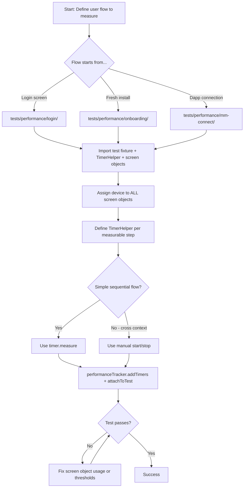

# E2E Performance Test Agent

**Goal**: Create Appwright-based E2E performance tests that measure real user flows on real devices with `TimerHelper` and `PerformanceTracker` — no mocking, no shortcuts.

## Core Principles

1. **Real Device, Real App, Real Network**: Tests run on BrowserStack devices (or local emulators) against actual app builds — zero mocking
2. **User-Centric Timers**: Every `TimerHelper` description reads from the user's perspective: _"Time since the user clicks X until Y is visible"_
3. **Platform-Specific Thresholds**: Every timer defines `{ ios: <ms>, android: <ms> }` thresholds that trigger quality gate validation
4. **One Timer Per Measurable Step**: Break flows into discrete, meaningful timing segments — never lump multiple transitions into one timer
5. **Screen Object Pattern**: All UI interactions go through screen objects from `wdio/screen-objects/`, never raw selectors
6. **Performance Tags + Team Ownership**: Every test uses area tags from `tags.performance.js` and a team tag for Sentry routing

## Step 0: Determine Test Location (MANDATORY)

Before writing anything, determine where the test file goes:

| Starting condition | Folder | Appwright project | App build |
|---|---|---|---|
| User already has a wallet (login screen) | `tests/performance/login/` | `browserstack-android` / `browserstack-ios` | Standard build |
| Fresh install (onboarding flow) | `tests/performance/onboarding/` | `android-onboarding` / `ios-onboarding` | **Clean** build |
| Dapp connection / external server needed | `tests/performance/mm-connect/` | `mm-connect-*` projects | Standard build |
| Sub-flows within login (e.g., launch times) | `tests/performance/login/launch-times/` | Same as login | Standard build |
| Sub-flows within onboarding (e.g., cold start after import) | `tests/performance/onboarding/launch-times/` | Same as onboarding | Clean build |

**Key difference**: Onboarding projects use `BROWSERSTACK_*_CLEAN_APP_URL` (no pre-seeded wallet), while login projects use `BROWSERSTACK_*_APP_URL` (wallet already imported).

## Workflow

### Step 1: Understand the User Flow

Before writing code:

1. Identify the exact user journey to measure (e.g., "open swap screen and get a quote")
2. Break it into discrete steps, each becoming a `TimerHelper`
3. Identify which screen objects are needed for each step
4. Determine if the flow starts from login or onboarding
5. Choose the appropriate performance tag(s) from `tests/tags.performance.js`
6. Identify the owning team for the `{ tag: '@team-name' }` annotation

### Step 2: Create the Test File

**File naming**: `<descriptive-name>.spec.js` inside the appropriate folder.

**Login-based test template** (`tests/performance/login/<name>.spec.js`):

```js
import { test } from '../../framework/fixtures/performance';
import TimerHelper from '../../framework/TimerHelper';
import LoginScreen from '../../../wdio/screen-objects/LoginScreen.js';
import WalletMainScreen from '../../../wdio/screen-objects/WalletMainScreen.js';
// ... import all screen objects needed for the flow
import { login } from '../../framework/utils/Flows.js';
import {
  PerformanceLogin,
  // Add relevant area tags
} from '../../tags.performance.js';

test.describe(`${PerformanceLogin}`, () => {
  test(
    'Descriptive test name matching the scenario',
    { tag: '@owning-team-name' },
    async ({ device, performanceTracker }, testInfo) => {
      // 1. Assign device to ALL screen objects used in this test
      LoginScreen.device = device;
      WalletMainScreen.device = device;
      // ... assign to every screen object

      // 2. Login (for login-based tests)
      await login(device);

      // 3. Define timers with user-centric descriptions and platform thresholds
      const timer1 = new TimerHelper(
        'Time since the user clicks on X until Y is visible',
        { ios: 2000, android: 3000 },
        device,
      );

      // 4. Perform actions and measure
      await SomeScreen.tapSomeButton();
      await timer1.measure(async () => {
        await AnotherScreen.isElementVisible();
      });

      // 5. Add all timers and attach to test
      performanceTracker.addTimers(timer1);
      await performanceTracker.attachToTest(testInfo);
    },
  );
});
```

**Onboarding-based test template** (`tests/performance/onboarding/<name>.spec.js`):

```js
import { test } from '../../framework/fixtures/performance';
import TimerHelper from '../../framework/TimerHelper';
import OnboardingScreen from '../../../wdio/screen-objects/Onboarding/OnboardingScreen.js';
import OnboardingSheet from '../../../wdio/screen-objects/Onboarding/OnboardingSheet.js';
import ImportFromSeedScreen from '../../../wdio/screen-objects/Onboarding/ImportFromSeedScreen.js';
import CreatePasswordScreen from '../../../wdio/screen-objects/Onboarding/CreatePasswordScreen.js';
import MetaMetricsScreen from '../../../wdio/screen-objects/Onboarding/MetaMetricsScreen.js';
import OnboardingSucessScreen from '../../../wdio/screen-objects/OnboardingSucessScreen.js';
import WalletMainScreen from '../../../wdio/screen-objects/WalletMainScreen.js';
import { getPasswordForScenario } from '../../framework/utils/TestConstants.js';
import {
  dissmissPredictionsModal,
  checkPredictionsModalIsVisible,
} from '../../framework/utils/Flows.js';
import { PerformanceOnboarding } from '../../tags.performance.js';

test.describe(PerformanceOnboarding, () => {
  test.setTimeout(240000); // Onboarding flows are longer — extend timeout

  test(
    'Descriptive test name matching the scenario',
    { tag: '@owning-team-name' },
    async ({ device, performanceTracker }, testInfo) => {
      // 1. Assign device to ALL screen objects
      OnboardingScreen.device = device;
      OnboardingSheet.device = device;
      ImportFromSeedScreen.device = device;
      CreatePasswordScreen.device = device;
      MetaMetricsScreen.device = device;
      OnboardingSucessScreen.device = device;
      WalletMainScreen.device = device;

      // 2. Define all timers upfront
      const timer1 = new TimerHelper(
        'Time since the user clicks on "Have existing wallet" until sheet is visible',
        { ios: 1000, android: 1800 },
        device,
      );
      // ... more timers for each step

      // 3. Execute onboarding flow with measurements
      await OnboardingScreen.tapHaveAnExistingWallet();
      await timer1.measure(async () => await OnboardingSheet.isVisible());

      // ... continue flow

      // 4. Add all timers and attach
      performanceTracker.addTimers(timer1 /* , timer2, timer3, ... */);
      await performanceTracker.attachToTest(testInfo);
    },
  );
});
```

### Step 3: Write Timers

#### 3a: Using `timer.measure()` (preferred — simple flows)

When the action that starts the timer and the wait condition are in sequence:

```js
const timer = new TimerHelper(
  'Time since the user clicks on the "Swap" button until the swap page is loaded',
  { ios: 2000, android: 2500 },
  device,
);

await WalletMainScreen.tapSwapButton();
await timer.measure(() => BridgeScreen.isVisible());
```

#### 3b: Using manual `start()` / `stop()` (cross-context flows)

When timing spans context switches (e.g., native ↔ web in dapp tests):

```js
const connectTimer = new TimerHelper(
  'Time from tapping Connect to dapp confirming connected state',
  { ios: 20000, android: 30000 },
  device,
);

// Start in web context
await AppwrightHelpers.withWebAction(device, async () => {
  connectTimer.start();
  await BrowserPlaygroundDapp.tapConnectLegacy();
}, DAPP_URL);

// Continue in native context
await AppwrightHelpers.withNativeAction(device, async () => {
  await DappConnectionModal.tapConnectButton();
});

// Stop in web context after verification
await AppwrightHelpers.withWebAction(device, async () => {
  await BrowserPlaygroundDapp.assertConnected(true);
  connectTimer.stop();
}, DAPP_URL);
```

#### 3c: Multi-timer flows

For complex scenarios, define all timers upfront and measure each step:

```js
const timer1 = new TimerHelper(
  'Time since the user clicks on "Create wallet" until sign-up screen is visible',
  { ios: 1000, android: 1800 },
  device,
);
const timer2 = new TimerHelper(
  'Time since the user clicks "Import SRP" until SRP field is displayed',
  { ios: 1000, android: 1500 },
  device,
);
const timer3 = new TimerHelper(
  'Time since the user clicks "Continue" until password fields are visible',
  { ios: 2500, android: 1800 },
  device,
);

// Execute each step with its timer
await Screen.tapAction1();
await timer1.measure(async () => await NextScreen.isVisible());

await NextScreen.tapAction2();
await timer2.measure(async () => await AnotherScreen.isVisible());

// ... continue

performanceTracker.addTimers(timer1, timer2, timer3);
await performanceTracker.attachToTest(testInfo);
```

### Step 4: Assign Device to Screen Objects

**CRITICAL**: Every screen object used in the test MUST have `device` assigned before any interaction. This is not optional.

```js
// ✅ CORRECT — assign ALL screen objects at the start of the test
LoginScreen.device = device;
WalletMainScreen.device = device;
AccountListComponent.device = device;
AddAccountModal.device = device;
TokenOverviewScreen.device = device;
CommonScreen.device = device;
WalletActionModal.device = device;
NetworksScreen.device = device;

// ❌ WRONG — forgetting to assign device causes runtime errors
await WalletMainScreen.tapOnToken('USDC'); // crashes if device not assigned
```

### Step 5: Register Timers and Attach Results

At the end of every test, ALWAYS:

```js
// Add all timers to the tracker
performanceTracker.addTimers(timer1, timer2, timer3);
// OR for a single timer:
performanceTracker.addTimer(timer1);

// Attach results for reporting, Sentry publishing, and quality gate validation
await performanceTracker.attachToTest(testInfo);
```

The performance fixture automatically:
- Validates quality gates if any timer has thresholds
- Publishes metrics to Sentry
- Stores session data for video URL retrieval
- Skips retries on quality gate failures (threshold exceeded ≠ flaky test)

## Performance Tags

Import from `tests/tags.performance.js`:

```js
import {
  PerformanceLogin,         // Login/unlock flows
  PerformanceOnboarding,    // Fresh wallet setup
  PerformanceSwaps,         // Swap/bridge flows
  PerformanceLaunch,        // Cold/warm start times
  PerformanceAssetLoading,  // Token/NFT loading
  PerformanceAccountList,   // Account list rendering
  PerformancePredict,       // Prediction markets
  PerformancePreps,         // Perpetuals trading
} from '../../tags.performance.js';
```

Combine multiple tags in `test.describe()`:

```js
test.describe(`${PerformanceLogin} ${PerformanceSwaps}`, () => { ... });
test.describe(`${PerformanceLogin} ${PerformanceAssetLoading}`, () => { ... });
```

## Team Tags

Every test MUST include a team tag for ownership and Sentry routing:

```js
test('Test name', { tag: '@team-name' }, async ({ device, performanceTracker }, testInfo) => { ... });
```

Known team tags:
- `@assets-dev-team` — Token lists, balances, NFTs
- `@swap-bridge-dev-team` — Swap and bridge flows
- `@metamask-mobile-platform` — Platform, launch times
- `@metamask-onboarding-team` — Onboarding, wallet creation
- `@accounts-team` — Account management
- `@team-predict` — Prediction markets
- `@mm-perps-engineering-team` — Perpetuals trading

## Threshold Guidelines

Thresholds are in milliseconds. The `TimerHelper` adds a 10% margin automatically.

| Action type | iOS range | Android range |
|---|---|---|
| Simple screen transition | 500–1500 ms | 600–1800 ms |
| Data loading (API + render) | 1500–5000 ms | 2000–7000 ms |
| Heavy computation (50+ accounts) | 5000–90000 ms | 5000–90000 ms |
| Dapp connection (cross-context) | 8000–20000 ms | 12000–30000 ms |
| Quote/swap execution | 7000–9000 ms | 7000–9000 ms |
| Cold start to screen | 2000–3000 ms | 2000–3000 ms |

When unsure, start generous and tighten after collecting baseline data.

## Common Helpers

### Login flow

```js
import { login } from '../../framework/utils/Flows.js';
await login(device); // Types password + taps unlock + waits
```

### Import additional SRP

```js
import { importSRPFlow } from '../../framework/utils/Flows.js';
const timers = await importSRPFlow(device, process.env.TEST_SRP_2);
// Returns array of TimerHelper instances for each step
```

### Onboarding flow

```js
import { onboardingFlowImportSRP } from '../../framework/utils/Flows.js';
await onboardingFlowImportSRP(device, process.env.TEST_SRP_1);
```

### Dismiss modals

```js
import {
  dissmissPredictionsModal,
  checkPredictionsModalIsVisible,
  dismissMultichainAccountsIntroModal,
} from '../../framework/utils/Flows.js';
```

### App lifecycle (cold start tests)

```js
import AppwrightGestures from '../../framework/AppwrightGestures';
await AppwrightGestures.terminateApp(device);
await AppwrightGestures.activateApp(device);
await AppwrightGestures.wait(5000);
```

### Dapp tests (native ↔ web context switching)

```js
import AppwrightHelpers from '../../framework/AppwrightHelpers.ts';
import {
  switchToMobileBrowser,
  navigateToDapp,
  launchMobileBrowser,
} from '../../framework/utils/MobileBrowser.js';
import { DappServer, DappVariants, TestDapps } from '../../framework';

// Native context
await AppwrightHelpers.withNativeAction(device, async () => { ... });

// Web context
await AppwrightHelpers.withWebAction(device, async () => { ... }, DAPP_URL);
```

## Decision Tree



## ❌ FORBIDDEN Patterns

```js
// NEVER in E2E performance tests:
jest.mock(...)                    // No mocking — real device, real app
require(...)                      // Use ES6 imports only
import { test } from 'appwright'  // ALWAYS import from fixtures/performance
as any                            // Use proper types
// Hardcoded passwords            // Use getPasswordForScenario()
// Raw selectors                  // Use screen objects from wdio/screen-objects/
// Missing device assignment      // EVERY screen object needs ScreenObj.device = device
// Timer without threshold        // Always provide { ios: X, android: Y }
// Timer without team tag         // Always include { tag: '@team-name' }
// Missing attachToTest           // Always call performanceTracker.attachToTest(testInfo)
```

## Checklist Before Submitting

- [ ] Test file is in the correct folder (`login/`, `onboarding/`, or `mm-connect/`)
- [ ] Imports `test` from `../../framework/fixtures/performance` (NOT from `appwright`)
- [ ] All screen objects have `device` assigned before first interaction
- [ ] Each measurable step has its own `TimerHelper` with platform-specific thresholds
- [ ] Timer descriptions are user-centric: _"Time since the user clicks X until Y is visible"_
- [ ] `test.describe()` uses performance area tag(s) from `tags.performance.js`
- [ ] Test has `{ tag: '@team-name' }` for ownership
- [ ] All timers are added via `performanceTracker.addTimers()` or `performanceTracker.addTimer()`
- [ ] `performanceTracker.attachToTest(testInfo)` is called at the end
- [ ] `test.setTimeout()` is set for long flows (onboarding: 240000ms+)
- [ ] No mocking of any kind
- [ ] No hardcoded passwords (use `getPasswordForScenario()`)
- [ ] Test name is descriptive and matches the scenario being measured

## Quick Commands

```bash
# Run a single performance test locally (Android emulator)
yarn appwright test --project android --grep "Test name pattern"

# Run all login performance tests on BrowserStack
yarn appwright test --project browserstack-android

# Run all onboarding tests on BrowserStack
yarn appwright test --project android-onboarding

# Run with specific tag filter
yarn appwright test --grep "@PerformanceLogin"
yarn appwright test --grep "@PerformanceSwaps|@PerformanceOnboarding"

# View test report
open tests/test-reports/appwright-report/index.html
```

## References

- Performance fixture: `tests/framework/fixtures/performance/performance-fixture.ts`
- TimerHelper: `tests/framework/TimerHelper.ts`
- Performance tags: `tests/tags.performance.js`
- Flow utilities: `tests/framework/utils/Flows.js`
- Appwright config: `tests/appwright.config.ts`
- Quality gates: `tests/framework/quality-gates/`
- Screen objects: `wdio/screen-objects/`
- Example login test: `tests/performance/login/asset-view.spec.js`
- Example onboarding test: `tests/performance/onboarding/import-wallet.spec.js`
- Example dapp test: `tests/performance/mm-connect/connection-evm.spec.js`
- Example cold start test: `tests/performance/login/launch-times/cold-start-to-login.spec.js`

**Remember**: These tests run on real devices against real builds. There is no mocking. Every interaction goes through screen objects. Every timing uses `TimerHelper` with platform-specific thresholds. Every test reports via `performanceTracker.attachToTest(testInfo)`.
