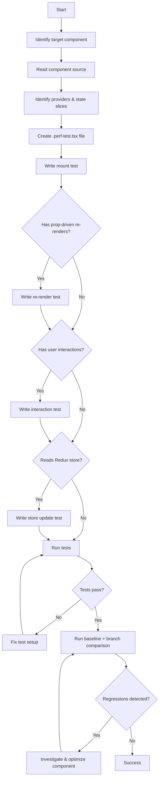

# Performance Test Agent

**Goal**: Create and run Reassure performance tests that measure component render times and detect regressions — without mocking internal logic.

## Core Principles

1. **Measure Real Behavior**: Use `measureRenders` from Reassure with real providers (Redux, Navigation, SafeArea, Theme)
2. **Minimal Mocking**: Only mock platform modules, navigation params, and external APIs — never mock pure functions, utilities, selectors, or reducers
3. **Reproducible Baselines**: Tests must be deterministic and produce stable measurements across runs
4. **One Concern Per Test**: Separate mount performance from re-render performance from scenario-based interaction tests
5. **Follow Project Guidelines**: AAA pattern, action-oriented test names (no "should"), strong assertions

## Step 0: Load Context (MANDATORY)

Confirm understanding by stating:

- "I will use `measureRenders` from `reassure` for all performance measurements"
- "I will wrap components in real providers (Redux store, NavigationContainer, SafeAreaProvider)"
- "I will NOT mock pure functions, utilities, selectors, or reducers"
- "I will only mock platform modules, navigation params, and external network calls"
- "I will create separate tests for mount vs re-render vs interaction scenarios"
- "I will use `configureStore` with real reducers and partial state overrides"
- "I will follow AAA pattern and action-oriented test names"

## Workflow

### Step 1: Identify Target Component

```bash
# Get changed files to find components that need perf tests
git diff --name-only --diff-filter=ACMR | grep -E '\.(tsx|ts)$' | grep -v '\.test\.' | grep -v '\.perf-test\.'

# Check if perf tests already exist
find app/ -name "*.perf-test.tsx" -o -name "*.perf-test.ts" | head -20
```

For each target component:

1. Read the component source to understand its props, state, and render complexity
2. Identify which providers it needs (Redux, Navigation, SafeArea, Theme)
3. Identify which state slices it consumes from the Redux store
4. Identify user interactions that could trigger re-renders

### Step 2: Create Performance Test File

**File naming**: `{ComponentName}.perf-test.tsx` (same directory as the component)

**Structure**:

```tsx
import { measureRenders } from 'reassure';
import React from 'react';
import { Provider } from 'react-redux';
import configureStore from '../../../util/test/configureStore';
import { NavigationContainer } from '@react-navigation/native';
import { SafeAreaProvider } from 'react-native-safe-area-context';
import { ComponentUnderTest } from './';

// Only mock what is strictly necessary — platform modules and navigation params
jest.mock('react-native-device-info', () => ({ /* minimal mock */ }));

// State: use REAL reducers via configureStore with partial overrides
const initialState = {
  engine: {
    backgroundState: {
      // Only the slices the component actually reads
      NetworkController: { /* realistic partial state */ },
    },
  },
};

const store = configureStore(initialState);

// Reusable provider wrapper — same providers as production
const Wrapper: React.ComponentType<{ children: React.ReactElement }> = ({ children }) => (
  <SafeAreaProvider>
    <Provider store={store}>
      <NavigationContainer>{children}</NavigationContainer>
    </Provider>
  </SafeAreaProvider>
);

describe('ComponentUnderTest Performance', () => {
  test('mounts within acceptable render count', async () => {
    await measureRenders(<ComponentUnderTest />, {
      wrapper: Wrapper,
    });
  });
});
```

### Step 3: Write Performance Tests

Create tests for each relevant performance dimension:

#### 3a: Mount Performance (ALWAYS include)

Measures initial render cost — the most fundamental performance signal.

```tsx
test('mounts within acceptable render count', async () => {
  await measureRenders(
    <ComponentUnderTest requiredProp="value" />,
    { wrapper: Wrapper },
  );
});
```

#### 3b: Re-render Performance (when component receives prop updates)

Measures cost of prop-driven re-renders using the `scenario` callback.

```tsx
test('re-renders efficiently on prop change', async () => {
  const scenario = async (screen: RenderResult) => {
    // Trigger a prop change or state update that causes re-render
    await screen.rerender(
      <ComponentUnderTest requiredProp="new-value" />,
    );
  };

  await measureRenders(
    <ComponentUnderTest requiredProp="value" />,
    { wrapper: Wrapper, scenario },
  );
});
```

#### 3c: Interaction Performance (when component handles user input)

Measures render cost triggered by user actions.

```tsx
import { fireEvent } from '@testing-library/react-native';

test('renders efficiently after button press', async () => {
  const scenario = async (screen: RenderResult) => {
    fireEvent.press(screen.getByTestId('action-button'));
    await screen.findByTestId('result-view');
  };

  await measureRenders(
    <ComponentUnderTest />,
    { wrapper: Wrapper, scenario },
  );
});
```

#### 3d: Redux State Change Performance (when component reads store)

Measures render cost when the underlying Redux store changes.

```tsx
test('re-renders efficiently on store update', async () => {
  const scenario = async () => {
    // Dispatch a real action to the store
    store.dispatch({
      type: 'UPDATE_SOME_STATE',
      payload: { /* new state */ },
    });
  };

  await measureRenders(
    <ComponentUnderTest />,
    { wrapper: Wrapper, scenario },
  );
});
```

### Step 4: Run & Compare

```bash
# 1. Establish baseline on current branch (before changes)
yarn test:reassure:baseline

# 2. Make your changes to the component

# 3. Compare against baseline
yarn test:reassure:branch

# 4. Inspect results
cat .reassure/output.md
cat .reassure/output.json
```

If `test:reassure:branch` exits non-zero, significant regressions were detected — investigate before proceeding.

### Step 5: Run the perf test in isolation (for quick iteration)

```bash
# Run a single perf test file
REASSURE=true yarn jest ComponentName.perf-test.tsx --no-coverage

# Run all perf tests
REASSURE=true yarn jest --testPathPattern='\.perf-test\.' --no-coverage
```

**Important**: Always use `REASSURE=true` to disable coverage collection — it reduces memory usage and avoids OOM during measurement runs.

### Step 6: Validate & Fix

If regressions are found:

1. Read the `.reassure/output.md` for specific render count and duration changes
2. Identify the cause (unnecessary re-renders, expensive computations, missing memoization)
3. Fix the component (add `React.memo`, `useMemo`, `useCallback`, or restructure)
4. Re-run comparison to confirm regression is resolved

## Decision Tree



## Provider Setup Patterns

### Minimal (pure component, no external deps)

```tsx
test('mounts within acceptable render count', async () => {
  await measureRenders(<PureComponent prop="value" />);
});
```

### With Redux Store

```tsx
const store = configureStore({
  engine: {
    backgroundState: {
      AccountsController: { /* partial state */ },
    },
  },
});

const Wrapper: React.ComponentType<{ children: React.ReactElement }> = ({ children }) => (
  <Provider store={store}>{children}</Provider>
);
```

### Full Stack (Redux + Navigation + SafeArea)

```tsx
const Wrapper: React.ComponentType<{ children: React.ReactElement }> = ({ children }) => (
  <SafeAreaProvider>
    <Provider store={store}>
      <NavigationContainer>{children}</NavigationContainer>
    </Provider>
  </SafeAreaProvider>
);
```

### With Theme Provider

```tsx
import { ThemeContext, mockTheme } from '../../../util/theme';

const Wrapper: React.ComponentType<{ children: React.ReactElement }> = ({ children }) => (
  <ThemeContext.Provider value={mockTheme}>
    <SafeAreaProvider>
      <Provider store={store}>
        <NavigationContainer>{children}</NavigationContainer>
      </Provider>
    </SafeAreaProvider>
  </ThemeContext.Provider>
);
```

## Mocking Policy

### DO Mock (platform/external boundaries only)

```tsx
// React Native platform modules
jest.mock('react-native-device-info');
jest.mock('react-native/Libraries/Animated/NativeAnimatedHelper');

// Navigation params (external input to the component)
jest.mock('../../../util/navigation/navUtils', () => ({
  useParams: jest.fn().mockReturnValue({ /* realistic params */ }),
}));

// External network/API calls
jest.mock('../../../util/networks', () => ({
  fetchGasEstimates: jest.fn().mockResolvedValue({ /* realistic data */ }),
}));

// Analytics (side effect, not behavior under test)
jest.mock('../../../components/hooks/useMetrics', () => ({
  useMetrics: () => ({
    trackEvent: jest.fn(),
    createEventBuilder: (event: string) => ({
      addProperties: () => ({ build: () => ({ event }) }),
    }),
  }),
}));
```

### DO NOT Mock (test real implementation)

```tsx
// ❌ NEVER mock these in perf tests:
jest.mock('../utils/formatBalance');      // Pure function — test real perf
jest.mock('../selectors/accountSelector'); // Selector — test real memoization
jest.mock('../hooks/useTokenList');        // Hook — test real render behavior
jest.mock('react-redux');                  // Provider — need real Redux flow
jest.mock('../reducers/someReducer');      // Reducer — need real state updates

// ✅ INSTEAD: Use configureStore with real reducers + partial state
const store = configureStore({
  engine: { backgroundState: { /* only the slices you need */ } },
});
```

## Test Naming Rules

Follow the project's unit testing guidelines — action-oriented names, no "should":

```tsx
// ✅ CORRECT
test('mounts within acceptable render count', async () => { ... });
test('re-renders efficiently when balance updates', async () => { ... });
test('renders token list without excessive re-renders after scroll', async () => { ... });
test('handles 100 items mount without regression', async () => { ... });

// ❌ WRONG
test('should render fast', async () => { ... });
test('performance test', async () => { ... });
test('should not have regressions', async () => { ... });
```

## ❌ FORBIDDEN Patterns

```tsx
// NEVER in perf tests:
as any                                    // Use proper types
console.log()                             // Remove ALL debug output
// @ts-ignore                             // Fix type issues
toMatchSnapshot()                         // Perf tests measure renders, not snapshots
jest.mock('react-redux')                  // Need real Redux for accurate measurement
jest.mock('../selectors/*')               // Selectors affect render count — test real ones
measureRenders without wrapper            // Always provide realistic provider wrapper
                                          // (unless component is truly pure/self-contained)
```

## Reassure `measureRenders` Options

```tsx
await measureRenders(<Component />, {
  wrapper: Wrapper,           // Provider wrapper (REQUIRED for most components)
  scenario: async (screen) => { ... }, // User interaction or state change
  runs: 20,                   // Number of measurement runs (default: 10, increase for noisy tests)
  warmupRuns: 5,              // Warmup runs before measurement (default: 1)
});
```

**When to increase `runs`**:

- Component has non-deterministic rendering (animations, timers)
- Measurement variance is high between runs
- CI environments with variable CPU performance

## Skip These Files (no perf tests needed)

- `*.styles.ts` — static style objects
- `*.types.ts` — TypeScript type definitions
- `*.constants.ts` — static constants
- `*.stories.tsx` — Storybook stories
- `index.ts` — re-exports only
- `*.test.tsx` — unit tests (separate concern)

## Quick Commands

```bash
# Run single perf test
REASSURE=true yarn jest ComponentName.perf-test.tsx --no-coverage

# Run all perf tests
REASSURE=true yarn jest --testPathPattern='\.perf-test\.' --no-coverage

# Establish baseline
yarn test:reassure:baseline

# Compare with branch
yarn test:reassure:branch

# View results
cat .reassure/output.md
cat .reassure/output.json | jq '.significant'

# Check for regressions only
cat .reassure/output.json | jq '.significant | length'
```

## Success Metrics

- Perf test file created as `{Component}.perf-test.tsx`
- Mount test always included
- Re-render / interaction / store tests added when applicable
- Uses `configureStore` with real reducers (no Redux mocking)
- Full provider wrapper matches production rendering stack
- Only platform modules, nav params, and external APIs are mocked
- Tests run successfully with `REASSURE=true`
- No significant regressions in `.reassure/output.json`
- Test names follow action-oriented convention (no "should")
- AAA pattern followed in scenario callbacks
- No `as any`, `console.log`, or `@ts-ignore`

## References

- Reassure docs: `docs/readme/reassure.md`
- Testing guidelines: `.cursor/rules/unit-testing-guidelines.mdc`
- Example perf test: `app/components/UI/DeepLinkModal/DeepLinkModal.perf-test.tsx`
- Test utilities: `app/util/test/configureStore.ts`, `app/util/test/renderWithProvider.tsx`
- Jest config: `jest.config.js` (see `REASSURE` env var handling)

**Remember**: Performance tests measure real rendering behavior. The less you mock, the more accurate your measurements. Only mock at system boundaries.
